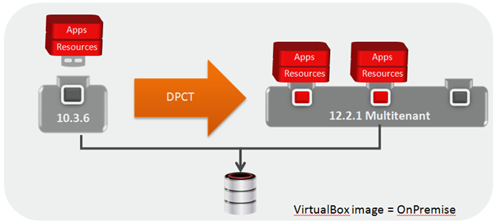
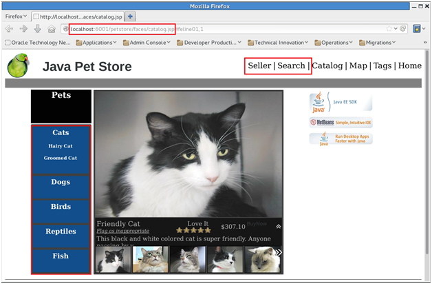
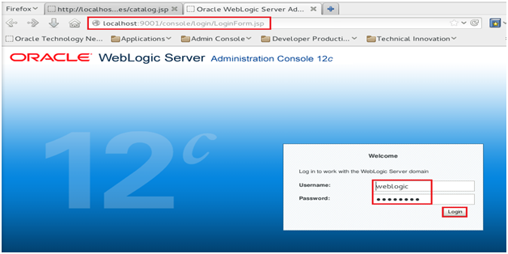
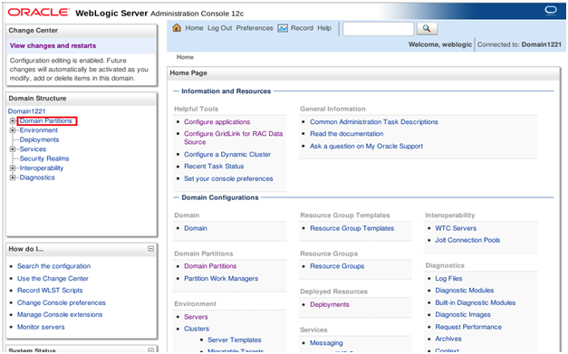
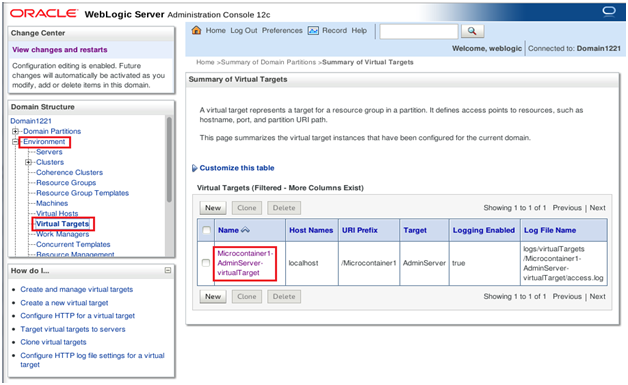
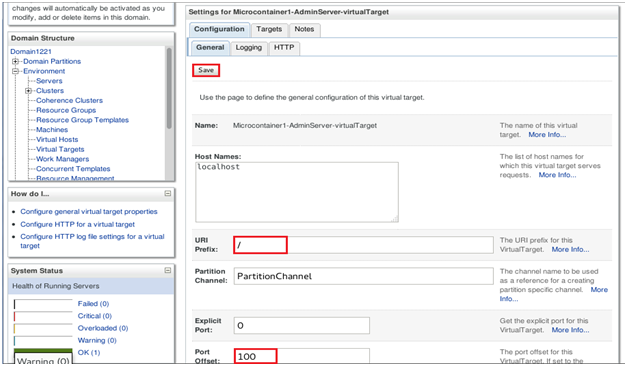
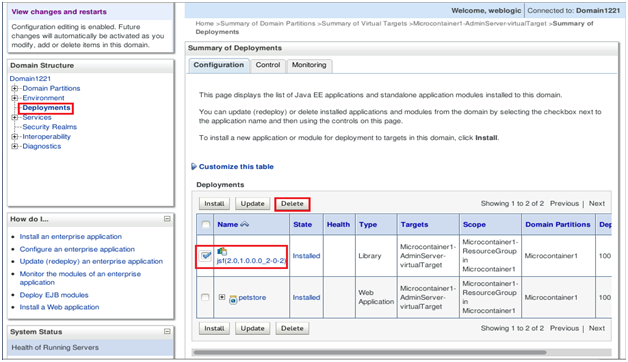
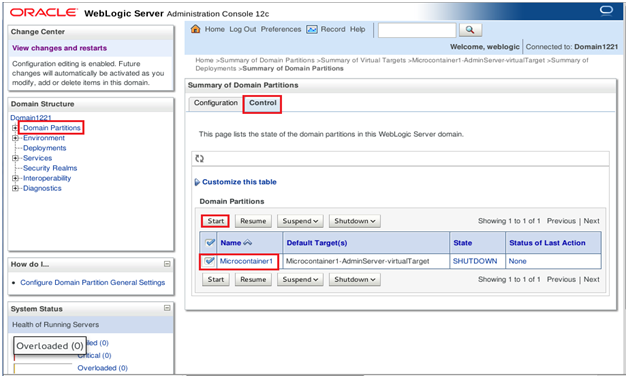
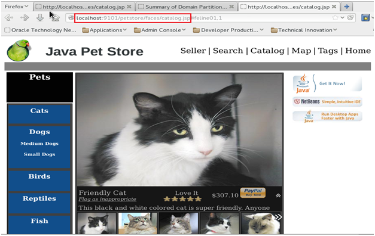

# ORACLE Public Cloud Services tutorial #
-----
## Convert WebLogic 11g domain into the 12cR2 partition using DPCT (Domain to Partition Conversion Tool) ##

### About this tutorial ###

This part of the tutorial shows how to convert existing Weblogic Server 11g domain into the importable format of WebLogic Server 12cR2 Domain Partition and import that pertition into WebLogic Server 12cR2 domain

Inside VirtualBox VM we have already created Domain1036 in `/u01/wins/wls1036/user_projects/domains/Domain1036`. This domain contains Admin Server only, we created PetstoreDB as Datasource and Deployed JSF-2.0.war as shared library and deployed petstore.12.war as an application to the Admin Server. This is the **source domain**, which we are going to convert to the image of the WebLogic Domain Partition through DPCT tool. This process will create a Domain1036.zip and Domain1036-attributes.json file.

We have also created Domain1221 in `/u01/wins/wls1221/user_projects/domains/Domain1221`. This is empty domain, which contains Admin Server only. This will be our **target domain**, where we will import the previous domain Domain1036 as partition. 

### Prerequisites ###

- Configured WebLogic Server 11g domain with sample application
- Configured WebLogic Server 12cR2 domain
- Running Oracle Database with application data needed for sample application

### Steps ###

#### Starting the Admin Server in both domains ####

Open a terminal window and move to `/u01/content/weblogic-innovation-seminars/WInS_Demos/MT-Workshop/Lab8` folder.

    $ [oracle@localhost Desktop]$ cd /u01/content/weblogic-innovation-seminars/WInS_Demos/MT-Workshop/Lab8
  

Run prepared script that prepares the environment.

    $ [oracle@localhost Lab8]$ ./prepare_env.sh 

-	It starts the pluggable database **pdborcl**.
-	It creates the **petstore** user in pdborcl database, and populates the database with sample data.
-	It sets the **JAVA\_HOME** to **/usr/java/jdk1.7.0_79/** and **MW\_HOME** to **/u01/wins/wls1036/** then it starts the Admin Server in Domain1036.
-	Then it sets the **JAVA\_HOME** to **/usr/java/latest/** (JDK 8) and **MW_HOME** to **/u01/wins/wls1221/** then it starts the Admin Server in Domain1221.

	
		********** STARTING DB ************************************************************
		Proxy NOT SET for Oracle Network!!!
		Proxy NOT SET for Oracle Network!!!
		Proxy NOT SET for Oracle Network!!!
		Default Java: 1.8.0_60
		
		Database Information:
		Oracle CDB SID	: orcl (system/welcome1)
		Pluggable PDB1:	pdborcl
		Pluggable PDB2:	pdb2 (systempdb2/welcome1)
		
			*** Please note 
		1) Ensure you have the latest WInS Demos code by running the "Update WInS Demos" command on the desktop!
		2) Ensure you have configured the proxy for the Oracle network if you are on the Oracle Network or VPN!
		3) This appliance is for testing purposes only, as such it is unsupported and should not be used as a production environment.
		
		
		Processing Database instance "orcl": log file /u01/app/oracle/product/12.1.0/dbhome_1/startup.log
		********** CREATING DB ENTRIES FOR PetStore Application ***************************
		
		SQL*Plus: Release 12.1.0.2.0 Production on Thu Sep 15 05:43:25 2016
		
		Copyright (c) 1982, 2014, Oracle.  All rights reserved.
		
		Last Successful login time: Thu Sep 15 2016 05:38:47 -07:00
		
		Connected to:
		Oracle Database 12c Enterprise Edition Release 12.1.0.2.0 - 64bit Production
		With the Partitioning, OLAP, Advanced Analytics and Real Application Testing options
		
		SQL> 
		drop user petstore cascade
		          *
		ERROR at line 1:
		ORA-01918: user 'PETSTORE' does not exist

		SQL> 
		User created.
		
		SQL> 
		Grant succeeded.

		SQL> Disconnected from Oracle Database 12c Enterprise Edition Release 12.1.0.2.0 - 64bit Production
		With the Partitioning, OLAP, Advanced Analytics and Real Application Testing options
		
		SQL*Plus: Release 12.1.0.2.0 Production on Thu Sep 15 05:43:39 2016
		
		Copyright (c) 1982, 2014, Oracle.  All rights reserved.
		
		
		Connected to:
		Oracle Database 12c Enterprise Edition Release 12.1.0.2.0 - 64bit Production
		With the Partitioning, OLAP, Advanced Analytics and Real Application Testing options
		
		SQL> 
		Table created.
		...
		...
		...
		1 row created.
	
	
		Commit complete.
	
		SQL> Disconnected from Oracle Database 12c Enterprise Edition Release 12.1.0.2.0 - 64bit Production
		With the Partitioning, OLAP, Advanced Analytics and Real Application Testing options
		********** STARTING ADMIN (WEBLOGIC 10.3.6 - DOMAIN1036) **************************
		********** ADMIN SERVER (WEBLOGIC 10.3.6 - DOMAIN1036) HAS BEEN STARTED ***********
		********** STARTING ADMIN SERVER (WEBLOGIC 12.2.1 - DOMAIN1221) *******************
		********** ADMIN SERVER (WEBLOGIC 12.2.1 - DOMAIN1221) HAS BEEN STARTED ***********

Go to browser and access the application URL on [http://localhost:6001/petstore/faces/catalog.jsp](http://localhost:6001/petstore/faces/catalog.jsp) . You can use the Bookmark.

We are using **Pet Store** application which was created by Sun engineers in 2009(!) to demonstrate JEE5 and other features. You can click on different Animal name like Cats, Dogs and Birds. You can also click on Seller and Search for verification of application Execution. Due to external API changes some of the functions do not work of the demo application. 

#### Running Domain to Partition Conversion Tool ####

We have put the Domain to Partition conversion tool in `/u01/dpct` folder.

Go back to terminal window and verify if **JAVA_HOME** variable is properly set.

    $ [oracle@localhost Lab8]$ $JAVA_HOME/bin/java -version
	java version "1.8.0_60"
	Java(TM) SE Runtime Environment (build 1.8.0_60-b27)
	Java HotSpot(TM) 64-Bit Server VM (build 25.60-b23, mixed mode)
	[oracle@localhost Lab8]$ 
    
The displayed value should be `java version "1.8.0_60"`, which is required for DPCT tool to run.

Move to DPCT folder location and execute DPCT tool

    $ [oracle@localhost Lab8]$ cd /u01/dpct
    $ [oracle@localhost dpct]$ ./exportDomainForPartition.sh /u01/wins/wls1036/ /u01/wins/wls1036/user_projects/domains/Domain1036/ 

This command creates the *Domain1036.zip* and *Domain1036-attributes.json* file in `/u01/dpct/outDir/folder`

	CLASSPATH=/u01/dpct/com.oracle.weblogic.management.tools.migration.jar::/u01/wins/wls1036/patch_wls1036/profiles/default/sys_manifest_classpath/weblogic_patch.jar:/u01/wins/wls1036/patch_ocp371/profiles/default/sys_manifest_classpath/weblogic_patch.jar:/usr/java/latest/lib/tools.jar:/u01/wins/wls1036/wlserver_10.3/server/lib/weblogic_sp.jar:/u01/wins/wls1036/wlserver_10.3/server/lib/weblogic.jar:/u01/wins/wls1036/modules/features/weblogic.server.modules_10.3.6.0.jar:/u01/wins/wls1036/wlserver_10.3/server/lib/webservices.jar:/u01/wins/wls1036/modules/org.apache.ant_1.7.1/lib/ant-all.jar:/u01/wins/wls1036/modules/net.sf.antcontrib_1.1.0.0_1-0b2/lib/ant-contrib.jar::/u01/wins/wls1036/utils/config/10.3/config-launch.jar::/u01/wins/wls1036/wlserver_10.3/common/derby/lib/derbynet.jar:/u01/wins/wls1036/wlserver_10.3/common/derby/lib/derbyclient.jar:/u01/wins/wls1036/wlserver_10.3/common/derby/lib/derbytools.jar::
	
	Initializing WebLogic Scripting Tool (WLST) ...
	
	Welcome to WebLogic Server Administration Scripting Shell
	
	Type help() for help on available commands
	
	WLST homepath:
	/u01/dpct/tmpwlst
	['/u01/wins/wls1036/wlserver_10.3/server/lib/weblogic.jar/Lib', '__classpath__', '/u01/wins/wls1036/wlserver_10.3/server/lib/weblogic.jar', '/u01/wins/wls1036/wlserver_10.3/common/wlst/modules/jython-modules.jar/Lib', '/u01/wins/wls1036/wlserver_10.3/common/wlst', '/u01/wins/wls1036/wlserver_10.3/common/wlst/lib', '/u01/wins/wls1036/wlserver_10.3/common/wlst/modules', '/u01/dpct/tmpwlst', '/u01/dpct/tmpwlst/lib', '/u01/dpct/tmpwlst/modules', '.']
	Export a non-MT domain for migration
	from domain path: /u01/wins/wls1036/user_projects/domains/Domain1036/
	reading domain ......
	domain name: Domain1036
	drw-   AppDeployment
	drw-   EmbeddedLDAP
	drw-   JDBCSystemResource
	drw-   Library
	drw-   Security
	drw-   SecurityConfiguration
	drw-   Server
	working on Server, listing ...
	drw-   AdminServer
	writing server for AdminServer
	working on AppDeployment, listing ...
	drw-   petstore
	writing app-deployment for petstore
	-rw-   AltDescriptorPath                             null
	-rw-   AltWLSDescriptorPath                          null
	-rw-   ApplicationIdentifier                         null
	-rw-   ApplicationName                               null
	-rw-   CompatibilityName                             null
	-rw-   DeploymentOrder                               100
	-rw-   DeploymentPrincipalName                       null
	-rw-   InstallDir                                    null
	-rw-   ModuleType                                    war
	-rw-   Name                                          petstore
	-rw-   Notes                                         null
	-rw-   PlanDir                                       null
	-rw-   PlanPath                                      null
	-rw-   SecurityDdModel                               DDOnly
	-rw-   SourcePath                                    /u01/wins/wls1036/user_projects/applications/Domain1036/petstore.12.war
	-rw-   StagingMode                                   null
	-rw-   Target                                        AdminServer
	-rw-   ValidateDdSecurityData                        false
	-rw-   VersionIdentifier                             null
	working on Library, listing ...
	drw-   jsf#2.0@1.0.0.0_2-0-2
	writing library for jsf#2.0@1.0.0.0_2-0-2
	-rw-   AltDescriptorPath                             null
	-rw-   AltWLSDescriptorPath                          null
	-rw-   ApplicationIdentifier                         null
	-rw-   ApplicationName                               null
	-rw-   CompatibilityName                             null
	-rw-   DeploymentOrder                               100
	-rw-   DeploymentPrincipalName                       null
	-rw-   InstallDir                                    null
	-rw-   ModuleType                                    war
	-rw-   Name                                          jsf#2.0@1.0.0.0_2-0-2
	-rw-   Notes                                         null
	-rw-   PlanDir                                       null
	-rw-   PlanPath                                      null
	-rw-   SecurityDdModel                               DDOnly
	-rw-   SourcePath                                    /u01/wins/wls1036/wlserver_10.3/common/deployable-libraries/jsf-2.0.war
	-rw-   StagingMode                                   null
	-rw-   Target                                        AdminServer
	-rw-   ValidateDdSecurityData                        false
	-rw-   VersionIdentifier                             null
	working on JDBCSystemResource, listing ...
	drw-   PetstoreDB
	writing jdbc-system-resource for PetstoreDB
	processing component-specific export handlers
	create archive zip file ...
	domain migration archive file: /u01/dpct/outDir/Domain1036.zip
	generating domain migration archive completed.
	
	
	Exiting WebLogic Scripting Tool.
	
	Export Weblogic domain completed to outDir.
	total 9932
	-rw-r-----. 1 oracle oracle      823 Sep 15 06:05 Domain1036-attributes.json
	-rw-r-----. 1 oracle oracle 10164841 Sep 15 06:05 Domain1036.zip

#### Import Domain as Partition in WebLogic 12.2.1 Multitenant environment ####

Go to the browser and type the URL for Admin Console of Domain1221 domain [http://localhost:9001/console](http://localhost:9001/console) . Or click on the console bookmark.

Enter weblogic/welcome1 as Username/Password then click on Login

In Domain Structure, Click on Domain Partitions.

Click on **Import**, specify **Microcontainer1** as **Domain Partition name** and **/u01/dpct/outDir/Domain1036.zip** as **Path** then click on OK.

Click on `Environment -> Virtual Targets`, and then click on `Microcontainer1-AdminServer-virtualTarget`

Modify the URI Prefix to **/** and set Port Offset to **100** and then click on Save

Click on Deployments, as jsf-2.0.war is implementation of JSF 2.0 that is part of JavaEE 6 it is already bundled with WebLogic Server 12.2.1 installation, so we don’t need it as part of deployment that was needed in pre JavaEE 6 container (11g). Check the box for jsf(2.0,1.0.0.0_2-0-2) and then click on Delete

Click on Domain Partitions and then click on Control tab, check the box for Microcontainer1 and then click on Start

Wait for 5-6 seconds, and then click on Configuration tab of Domain Partitions. Once this partition is in RUNNING State, and then only goes to next step.

Access the Application on [http://localhost:9101/petstore/faces/catalog.jsp](http://localhost:9101/petstore/faces/catalog.jsp) or using the bookmark.

	
