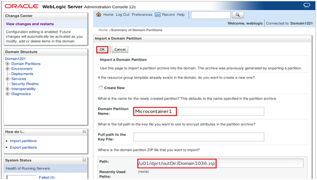
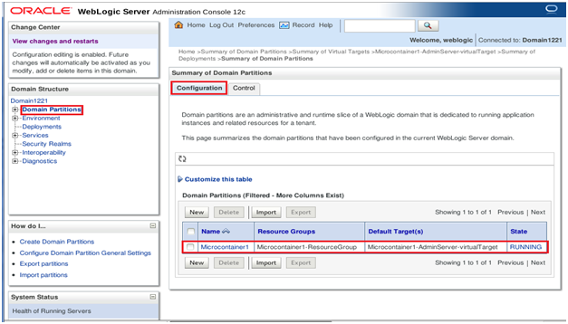

# ORACLE Public Cloud Services tutorial #
-----
## Convert WebLogic 11g domain into the 12cR2 partition through DPCT tool ##

### About this tutorial ###

This part of the tutorial showe how to convert existing Weblogic Server 11g domain into the importable format of WebLogic Server 12cR2 Domain Partition and import that pertition into WebLogic Server 12cR2 domain

Inside VirtualBox VM we have already created Domain1036 in /u01/wins/wls1036/user_projects/domains/Domain1036. This domain contains Admin Server only, we created PetstoreDB as Datasource and Deployed JSF-2.0.war as shared library and deployed petstore.12.war as an application to the Admin Server. This is the **source domain**, which we are going to convert to the image of the WebLogic Domain Partition through DPCT tool. This process will create a Domain1036.zip and Domain1036-attributes.json file.

We have also created Domain1221 in /u01/wins/wls1221/user_projects/domains/Domain1221. This is empty domain, which contains Admin Server only. This will be our **target domain**, where we will import the previous domain Domain1036 as partition. 

### Prerequisites ###

- Configured WebLogic Server 11g domain with sample application
- Configured WebLogic Server 12cR2 domain
- Running Oracle Database with application data needed for sample application

### Steps ###

#### Starting the Admin Server in both domains ####

Open a terminal window and move to /u01/content/weblogic-innovation-seminars/WInS_Demos/MT-Workshop/Lab8

    $ [oracle@localhost Desktop]$ cd /u01/content/weblogic-innovation-seminars/WInS_Demos/MT-Workshop/Lab8
  

Copy prepared script that prepares the environment

    $ [oracle@localhost Lab8]$ ./prepare_env.sh 

-	It starts the pluggable database **pdborcl**.
-	It creates the **petstore** user in pdborcl database, and populates the database with sample data.
-	It sets the **JAVA_HOME** to **/usr/java/jdk1.7.0_79/** and **MW_HOME** to **/u01/wins/wls1036/** then it starts the Admin Server in Domain1036.
-	Then it sets the **JAVA_HOME** to **/usr/java/latest/** (JDK 8) and **MW_HOME** to **/u01/wins/wls1221/** then it starts the Admin Server in Domain1221.

**TBD output of the script**

Go to browser and access the application URL on [http://localhost:6001/petstore/faces/catalog.jsp](http://localhost:6001/petstore/faces/catalog.jsp) . You can use the Bookmark.

We are using **Pet Store** application which was created by Sun engineers in 2009(!) to demonstrate JEE5 and other features. You can click on different Animal name like Cats, Dogs and Birds. You can also click on Seller and Search for verification of application Execution. Due to external API changes some of the functions do not work of the demo application. 

#### Running Domain to Partition Conversion Tool ####

We have put the Domain to Partition conversion tool in `/u01/dpct` folder.

Go back to terminal window and verify if **JAVA_HOME** variable is properly set.

    $ [oracle@localhost Lab8]$ echo $JAVA_HOME
    
The displayed value should be `/usr/java/latest`, which is JDK 8 required for DPCT tool to run.

Move to DPCT folder location and execute DPCT tool

    $ [oracle@localhost Lab8]$ cd /u01/dpct
    $ [oracle@localhost dpct]$ ./exportDomainForPartition.sh /u01/wins/wls1036/ /u01/wins/wls1036/user_projects/domains/Domain1036/ 

This command creates the Domain1036.zip and Domain1036-attributes.json file in /u01/dpct/outDir/folder

**TBD OUTPUT NEEDED HERE**

#### Import Domain as Partition in WebLogic 12.2.1 Multitenant environment ####

Go to the browser and type the URL for Admin Console of Domain1221 domain [http://localhost:9001/console](http://localhost:9001/console) . Or click on the console bookmark.

Enter weblogic/welcome1 as Username/Password then click on Login

In Domain Structure, Click on Domain Partitions.

Click on **Import**, specify **Microcontainer1** as **Domain Partition name** and **/u01/dpct/outDir/Domain1036.zip** as **Path** then click on OK.

Click on `Environment -> Virtual Targets`, and then click on `Microcontainer1-AdminServer-virtualTarget`

Modify the URI Prefix to **/** and set Port Offset to **100** and then click on Save

Click on Deployments, as jsf-2.0.war is implementation of JSF 2.0 that is part of JavaEE 6 it is already bundled with WebLogic Server 12.2.1 installation, so we don’t need it as part of deployment that was needed in pre JavaEE 6 container (11g). Check the box for jsf(2.0,1.0.0.0_2-0-2) and then click on Delete

Click on Domain Partitions and then click on Control tab, check the box for Microcontainer1 and then click on Start

Wait for 5-6 seconds, and then click on Configuration tab of Domain Partitions. Once this partition is in RUNNING State, and then only goes to next step.

Access the Application on [http://localhost:9101/petstore/faces/catalog.jsp](http://localhost:9101/petstore/faces/catalog.jsp) or using the bookmark.

	
