# ORACLE Public Cloud Services tutorial #
-----
## Move partition from WebLogic Server 12cR2 to Oracle Java Cloud Service ##

### About this tutorial ###

This part of the tutorial showe how to move Domain Partition from one domain to another. We will demonstrate it on the example that origin domain will be running on premise and target domain will run in Oracle Cloud

Exporting and importing partitions let WLS system administrators easily move partitions from one domain to another, including the applications that are deployed to the partition. This feature is useful for replicating partitions across the domains and for moving domains from a development to a testing then production environment. 
Exporting a domain partition creates a partition backup and stores it in an archived format. You can export a domain partition from source domain with its entire configuration and data. With few configuration changes, you can then import the partition archive into another instance of multi-tenant WLS (the target domain). You might need to update any domain dependencies, such as targets and security realms, and optionally update other attributes in the partition configuration to make it valid. 

When a partition is exported from the source domain it is packaged in a partition archive. Included in the partition archive is:
- The partition configuration.
- Any resource group contained in the partitions.
- Any resource group templates referred to by those resource groups. 
- The contents of the file system, <partition-file-system>/config directory. 
- Optionally, application binaries and configuration for applications deployed to the partition. 
No application runtime state or application-specific runtime configuration is included in the partition archive. Examples of what would not be exported are JMS messages in queues, users in an embedded LDAP realm.

In this Lab, We are going to perform the below operations:
- Export a domain partition from a vanilla domain in development mode in on premise environment.
- Import the domain partition to a domain which is running in production mode and also in Java Cloud Service.

### Prerequisites ###

- [Convert WebLogic 11g domain into the 12cR2 partition through DPCT tool](https://github.com/oracle-weblogic/weblogic-innovation-seminars/blob/caf-12.2.1/cloud.demos/HOL7606/dpct.11g.12R2.migration.md)
- Running Java Cloud Service Instance with WebLogic Servert 12cR2 (Domain partition configured) with corresponding Database Cloud Service Instance

### Steps ###

#### Export Domain Partition from on premise Domain1221 ####

Open in a browser console for on premise domain with WebLogic 12cR2. Login to that console if needed. Select **Domain Partitions** in a tree on left hand side and select checkbox for **Microcontainer1** and click on "Export" 

Check the box for **Include Application Bits**, and then enter **/u01/content/weblogic-innovation-seminars/WInS_Demos/MT-Workshop/Lab8/JCS** as Path and then click on OK

Go back to terminal and change to `/u01/content/weblogic-innovation-seminars/WInS_Demos/MT-Workshop/Lab8/JCS/` folder, and verify using `ls -la` the creation of *Microcontainer1.zip* and *Microcontainer1-attributes.json*. These files, we need while importing the partition in *winsdemoWLS_domain* in Java Cloud Service.

		[oracle@localhost dpct]$ cd /u01/content/weblogic-innovation-seminars/WInS_Demos/MT-Workshop/Lab8/JCS/
		[oracle@localhost JCS]$ ls -la
		total 7392
		drwxr-xr-x. 2 oracle oracle    4096 Sep 15 06:24 .
		drwxr-xr-x. 5 oracle oracle    4096 Sep 15 05:42 ..
		-rw-r--r--. 1 oracle oracle     716 Aug 17 03:47 createVT.py.sample
		-rw-r--r--. 1 oracle oracle      90 Jun 27 03:21 createVT.sh
		-rw-r-----. 1 oracle oracle    1077 Sep 15 06:24 Microcontainer1-attributes.json
		-rw-r-----. 1 oracle oracle 7538423 Sep 15 06:24 Microcontainer1.zip
		-rw-r--r--. 1 oracle oracle     479 Jun 27 03:21 removeDP.py.sample
		-rwxr-xr-x. 1 oracle oracle      90 Jun 27 03:21 removeDP.sh
		[oracle@localhost JCS]$ 

Go back to the `Lab8` folder and execute the following:
  
    $ [oracle@localhost Desktop]$ cd /u01/content/weblogic-innovation-seminars/WInS_Demos/MT-Workshop/Lab8
    $ [oracle@localhost Lab8]$ ./prepareCloudServices.sh
  
(The script copies the required files to DBCS instance first, and populate the database with sample data. Here we used the SQL scripts for that. In general, you can unplug the local database, copies related files to DBCS instance and then plug the pluggable database to database in DBCS or you can export and import database. But to simplify the demo, we used the SQL scripts here. Then it copies the ZIP and JSON file of exported partition to /tmp folder of JCS instance, and provides sufficient permissions. It also creates the Virtual Target Microcontainer1-AdminServer-virtualTarget using a short WLST script, which we will be used by the imported partition.)

	../../../cloud.demos/environment.properties found.
	Identity domain: paasdemo16
	Java Cloud Service Public IP address: 129.144.18.102
	Database Cloud Service Public IP address: 129.144.18.253
	[INFO] Scanning for projects...
	[INFO]                                                                         
	[INFO] ------------------------------------------------------------------------
	[INFO] Building LiftAndShift 1.0.0-SNAPSHOT
	[INFO] ------------------------------------------------------------------------
	Downloading: https://repo.maven.apache.org/maven2/org/codehaus/mojo/properties-maven-plugin/1.0-alpha-2/properties-maven-plugin-1.0-alpha-2.pom
	Downloaded: https://repo.maven.apache.org/maven2/org/codehaus/mojo/properties-maven-plugin/1.0-alpha-2/properties-maven-plugin-1.0-alpha-2.pom (4 KB at 4.5 KB/sec)
	Downloading: https://repo.maven.apache.org/maven2/org/codehaus/mojo/mojo-parent/21/mojo-parent-21.pom
	...
	...
	...             
	Downloaded: https://repo.maven.apache.org/maven2/org/codehaus/plexus/plexus-utils/1.5.6/plexus-utils-1.5.6.jar (245 KB at 1229.5 KB/sec)
	[INFO] 
	[INFO] --- maven-resources-plugin:2.6:resources (default-resources) @ LiftAndShift ---
	[INFO] Using 'UTF-8' encoding to copy filtered resources.
	[INFO] skip non existing resourceDirectory /u01/content/weblogic-innovation-seminars/WInS_Demos/MT-Workshop/Lab8/src/main/resources
	[INFO] 
	[INFO] --- maven-compiler-plugin:3.1:compile (default-compile) @ LiftAndShift ---
	[INFO] No sources to compile
	[INFO] 
	[INFO] --- maven-resources-plugin:2.6:testResources (default-testResources) @ LiftAndShift ---
	[INFO] Using 'UTF-8' encoding to copy filtered resources.
	[INFO] skip non existing resourceDirectory /u01/content/weblogic-innovation-seminars/WInS_Demos/MT-Workshop/Lab8/src/test/resources
	[INFO] 
	[INFO] --- maven-compiler-plugin:3.1:testCompile (default-testCompile) @ LiftAndShift ---
	[INFO] No sources to compile
	[INFO] 
	[INFO] --- maven-surefire-plugin:2.12.4:test (default-test) @ LiftAndShift ---
	[INFO] Tests are skipped.
	[INFO] 
	[INFO] --- maven-jar-plugin:2.4:jar (default-jar) @ LiftAndShift ---
	[WARNING] JAR will be empty - no content was marked for inclusion!
	[INFO] Building jar: /u01/content/weblogic-innovation-seminars/WInS_Demos/MT-Workshop/Lab8/target/LiftAndShift.jar
	[INFO] 
	[INFO] --- maven-install-plugin:2.4:install (default-install) @ LiftAndShift ---
	[INFO] Installing /u01/content/weblogic-innovation-seminars/WInS_Demos/MT-Workshop/Lab8/target/LiftAndShift.jar to /home/oracle/.m2/repository/com/oracle/wins/cloud/LiftAndShift/1.0.0-SNAPSHOT/LiftAndShift-1.0.0-SNAPSHOT.jar
	[INFO] Installing /u01/content/weblogic-innovation-seminars/WInS_Demos/MT-Workshop/Lab8/pom.xml to /home/oracle/.m2/repository/com/oracle/wins/cloud/LiftAndShift/1.0.0-SNAPSHOT/LiftAndShift-1.0.0-SNAPSHOT.pom
	[INFO] 
	[INFO] --- maven-antrun-plugin:1.8:run (replaceJCS) @ LiftAndShift ---
	Downloading: https://repo.maven.apache.org/maven2/commons-net/commons-net/1.4.1/commons-net-1.4.1.pom
	Downloaded: https://repo.maven.apache.org/maven2/commons-net/commons-net/1.4.1/commons-net-1.4.1.pom (5 KB at 46.4 KB/sec)
	...
	...
	...
	Downloaded: https://repo.maven.apache.org/maven2/ant/ant-commons-net/1.6.5/ant-commons-net-1.6.5.jar (35 KB at 134.1 KB/sec)
	[INFO] Executing tasks
	
	main:
	     [copy] Copying 2 files to /u01/content/weblogic-innovation-seminars/WInS_Demos/MT-Workshop/Lab8/JCS
	[INFO] Executed tasks
	[INFO] 
	[INFO] --- maven-antrun-plugin:1.8:run (replaceDBCS) @ LiftAndShift ---
	[INFO] Executing tasks
	
	main:
	     [copy] Copying 2 files to /u01/content/weblogic-innovation-seminars/WInS_Demos/MT-Workshop/Lab8/DBCS
	[INFO] Executed tasks
	[INFO] 
	[INFO] --- maven-antrun-plugin:1.8:run (copy2DBCS) @ LiftAndShift ---
	[INFO] Executing tasks
	
	main:
	     [echo] Copy artifacts to DBCS.
	      [scp] Connecting to 129.144.18.253:22
	      [scp] done.
	  [sshexec] Connecting to 129.144.18.253:22
	  [sshexec] cmd : chmod 755 /tmp/petstore.sql /tmp/prepareDBCS.sh
	  [sshexec] Connecting to 129.144.18.253:22
	  [sshexec] cmd : /tmp/prepareDBCS.sh
	
	SQL*Plus: Release 12.1.0.2.0 Production on Thu Sep 15 13:40:48 2016
	Copyright (c) 1982, 2014, Oracle.  All rights reserved.
	
	Last Successful login time: Wed Sep 14 2016 23:00:21 +00:00
	
	Connected to:
	Oracle Database 12c Enterprise Edition Release 12.1.0.2.0 - 64bit Production
	
	SQL>  drop user petstore cascade
	           *
	ERROR at line 1:
	ORA-01918: user 'PETSTORE' does not exist
	
	SQL> SQL> 
	
	User created.
	
	SQL> 
	
	Grant succeeded.
	
	SQL> Disconnected from Oracle Database 12c Enterprise Edition Release 12.1.0.2.0 - 64bit Production
	
	SQL*Plus: Release 12.1.0.2.0 Production on Thu Sep 15 13:40:49 2016
	Copyright (c) 1982, 2014, Oracle.  All rights reserved.
	
	Connected to:
	Oracle Database 12c Enterprise Edition Release 12.1.0.2.0 - 64bit Production
	
	SQL> 
	
	Table created.
	...
	...
	...
	1 row created.
	
	Commit complete.
	
	SQL> Disconnected from Oracle Database 12c Enterprise Edition Release 12.1.0.2.0 - 64bit Production
	
	[INFO] Executed tasks
	[INFO] 
	[INFO] --- maven-antrun-plugin:1.8:run (copyScript2JCS) @ LiftAndShift ---
	[INFO] Executing tasks
	
	main:
	     [echo] Copy artifacts to JCS.
	      [scp] Connecting to 129.144.18.102:22
	      [scp] done.
	  [sshexec] Connecting to 129.144.18.102:22
	  [sshexec] cmd : chmod 755 /tmp/Microcontainer1-attributes.json /tmp/Microcontainer1.zip /tmp/createVT.sh /tmp/createVT.py
	  [sshexec] Connecting to 129.144.18.102:22
	  [sshexec] cmd : sudo su - oracle -c /tmp/createVT.sh oracle
	
	Initializing WebLogic Scripting Tool (WLST) ...
	
	Welcome to WebLogic Server Administration Scripting Shell
	
	Type help() for help on available commands
	
	Cluster name: winsdemoWLS_cluster
	Connecting to t3://winsdemoWLS-wls-1.compute-paasdemo16.oraclecloud.internal:7001 with userid weblogic ...
	Successfully connected to Admin Server "winsdemo_adminserver" that belongs to domain "winsdemoWLS_domain".
	
	Warning: An insecure protocol was used to connect to the server. 
	To ensure on-the-wire security, the SSL port or Admin port should be used instead.
	
	Location changed to edit tree. 	 
	This is a writable tree with DomainMBean as the root. 	 
	To make changes you will need to start an edit session via startEdit(). 
	For more help, use help('edit').
	
	************************ Creating Virtual Target Microcontainer1-AdminServer-virtualTarget ****************************
	Starting an edit session ...
	Started edit session, be sure to save and activate your changes once you are done.
	Activating all your changes, this may take a while ... 
	The edit lock associated with this edit session is released once the activation is completed.
	Activation completed
	Disconnected from weblogic server: winsdemo_adminserver
	[INFO] Executed tasks
	[INFO] ------------------------------------------------------------------------
	[INFO] BUILD SUCCESS
	[INFO] ------------------------------------------------------------------------
	[INFO] Total time: 01:03 min
	[INFO] Finished at: 2016-09-15T06:41:35-07:00
	[INFO] Final Memory: 21M/491M
	[INFO] ------------------------------------------------------------------------
	Database Cloud Service has been prepared.
	Java Cloud Service has been prepared.

#### Import  Domain Partition in Java Cloud Service ####

Now open or switch to the browser and access to [http://cloud.oracle.com](http://cloud.oracle.com) site. Click on Sign In

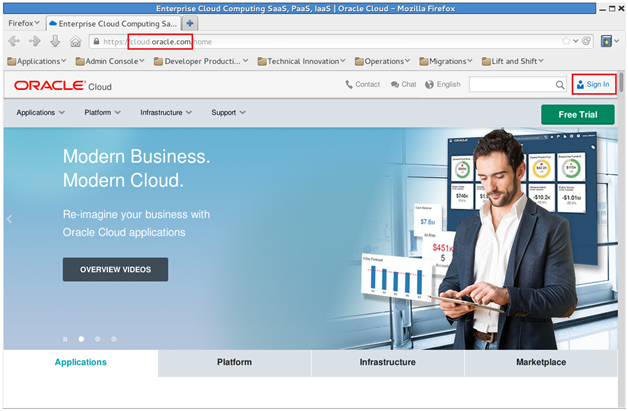

Select the appropriate datacenter. ( **US Commercial 2 (us2)** )

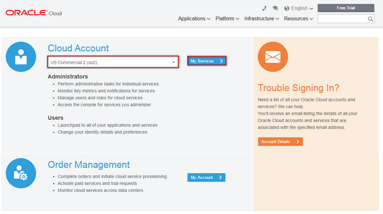

Enter your identity domain and click on "Go".

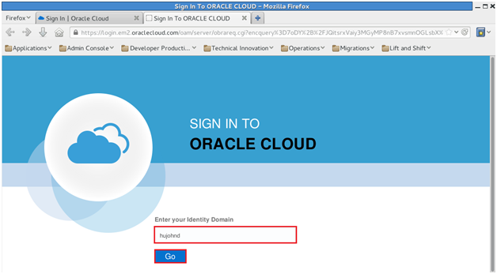

Enter your Oracle Public Cloud credentials and click on "Sign in".

Now click on the hamburger icon next to the Java Services to open service console. 

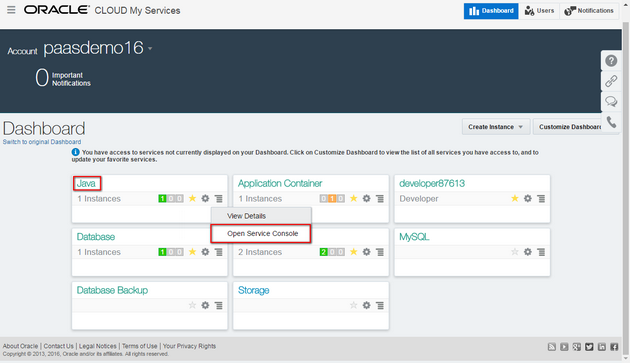

Click on the winsdemoWLS instance for more details

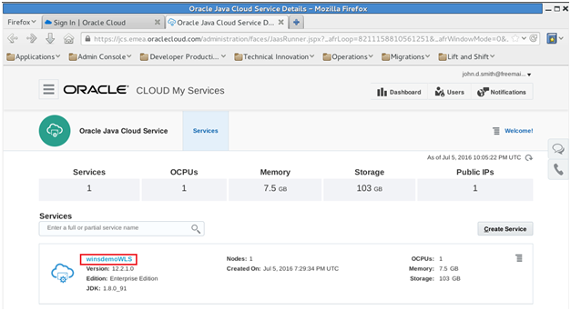

Click on the hamburger icon next to the instance navigation path. Select Open WebLogic Server Console to make the necessary correction after the import. Please note this change can be also automated by WLST scripts. The goal is here to demonstrate the Java Cloud Service capabilities.

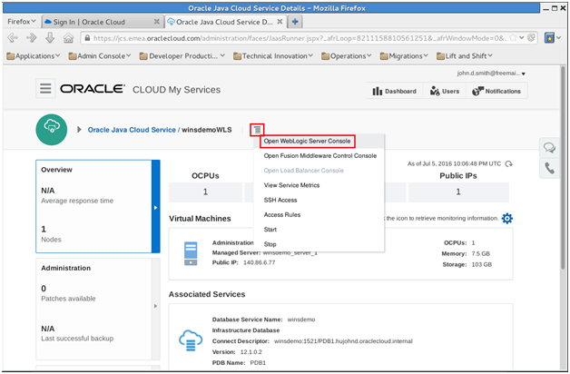

This will open a new tab and warn about missing certificate. This is because we didnt install any commercial SSL certificate and we use default the demo one. Add this site as an exception to access the console. If you face any issue in opening the admin console in Virtual box, you can use the host machine’s browser, to open the Admin Console URL.

Enter **weblogic/welcome1** as **Username/Password** and then click on "Login"

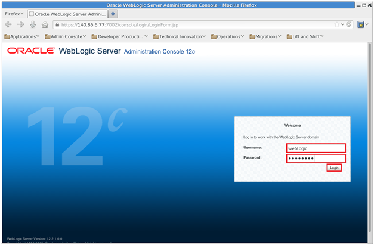

Click on "Domain Partitions" and then click on "Lock & Edit"

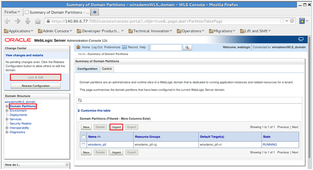

Click on "Import", specify the file **/tmp/Microcontainer1.zip** in the **Path** field and click on "OK".

Click on "Lock & Edit", and then select Services -> Data Sources -> PetstoreDB

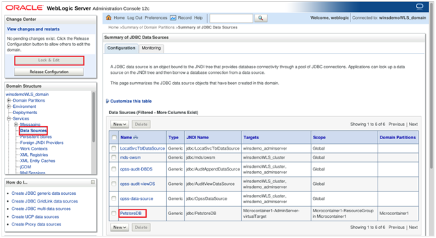

Click on the "Connection Pool" tab for PetstoreDB datasource, and modify the "URL" (jdbc:oracle:thin:@localhost:1521/pdborcl) with new value:
**jdbc:oracle:thin:@winsdemo:1521/ PDB1.{DOMAIN_ID}.oraclecloud.internal** 
and then click on "Save". Where DOMAIN\_ID is Identity Domain to which you logged in in oracle Cloud (look on the page distributed to you by the Instructor)

Click on "Activate Changes".

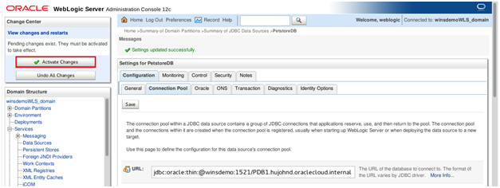

Click on "Domain Partitions", go to "Control" tab, check the box near "Microcontainer1" partition and then click on "Start". On the confirmation screen click on "Yes"

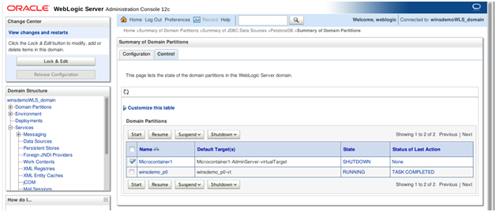

Click on the refresh icon, once the partition is in RUNNING state, go to the browser and access the application [http://{PUBLIC_IP_OF_JCS_INSTANCE}/petstore/faces/catalog.jsp](http://{PUBLIC_IP_OF_JCS_INSTANCE}/petstore/faces/catalog.jsp)

### Summary ###

1.	We took a domain Domain1036 created on WebLogic 10.3.6 Server, We used the Domain to Partition Conversion tool, to create archive and JSON file, which we later used for importing as partition in Domain1221 created on WebLogic 12.2.1 server. So in that way, Customer who has domain running in previous version of WebLogic Server, can be easily migrated to WebLogic Server 12.2.1 as partition.
2.	Exporting and Importing Partitions let WLS system administrators easily move partition from one domain to another, including the applications that are deployed to the partition. This features in useful for replicating partition across the domains and for moving domains from a development to a testing and then in production environment. Here we showed how you can replicate the partition running in development mode in on-premise to domain running in production mode in Java Cloud Service instance.  

