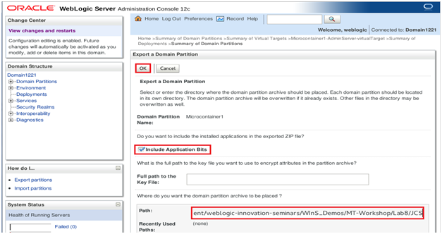

# ORACLE Public Cloud Services tutorial #
-----
## Move partition from WebLogic Server 12cR2 to Java Cloud Service ##

### About this tutorial ###

This part of the tutorial showe how to move Domain Partition from one domain to another. We will demonstrate it on the example that origin domain will be running on premise and target domain will run in Oracle Cloud

Exporting and importing partitions let WLS system administrators easily move partitions from one domain to another, including the applications that are deployed to the partition. This feature is useful for replicating partitions across the domains and for moving domains from a development to a testing then production environment. 
Exporting a domain partition creates a partition backup and stores it in an archived format. You can export a domain partition from source domain with its entire configuration and data. With few configuration changes, you can then import the partition archive into another instance of multi-tenant WLS (the target domain). You might need to update any domain dependencies, such as targets and security realms, and optionally update other attributes in the partition configuration to make it valid. 

When a partition is exported from the source domain it is packaged in a partition archive. Included in the partition archive is:
- The partition configuration.
- Any resource group contained in the partitions.
- Any resource group templates referred to by those resource groups. 
- The contents of the file system, <partition-file-system>/config directory. 
- Optionally, application binaries and configuration for applications deployed to the partition. 
No application runtime state or application-specific runtime configuration is included in the partition archive. Examples of what would not be exported are JMS messages in queues, users in an embedded LDAP realm.

In this Lab, We are going to perform the below operations:
- Export a domain partition from a vanilla domain in development mode in on premise environment.
- Import the domain partition to a domain which is running in production mode and also in Java Cloud Service.

### Prerequisites ###

- Configured WebLogic Server 12cR2 domain with domain partition
- Running Java Cloud Service Instance with WebLogic Servert 12cR2 with corresponding Database Cloud Service Instance

### Steps ###

#### Export Domain Partition from on premise Domain1221 ####

Open in a browser console for on premise domain with WebLogic 12cR2. Login to that console if needed. Select **Domain Partitions** in a tree on left hand side and select checkbox for **Microcontainer1** and click on "Export" 

Check the box for **Include Application Bits**, and then enter **/u01/content/weblogic-innovation-seminars/WInS_Demos/MT-Workshop/Lab8/JCS** as Path and then click on OK

Go back to terminal, and verify the creation of `Microcontainer1.zip` and `Microcontainer1-attributes.json`. These files, we need while importing the partition in winsdemoWLS_domain in Java Cloud Service

**TBD OUTPUT IS MISSING HERE**

Eecute the following maven project:
  
    $ [oracle@localhost Desktop]$ cd /u01/content/weblogic-innovation-seminars/WInS_Demos/MT-Workshop/Lab8
    $ [oracle@localhost Lab8]$ mvn install -DLiftAndShift -Djcs.ip={PUBLIC IP OF JCS INSTANCE} -Ddbcs.ip={PUBLIC IP OF DBCS INSTANCE}
  
  

 
(The above maven command copies the required files to DBCS instance first, and populate the database with sample data. Here we used the SQL scripts for that, In general, you can unplug the local database, copies related files to DBCS instance and then plug the pluggable database to database in DBCS or you can export and import database. But to simply the demo, we used the SQL scripts here. Then it copies the ZIP and JSON file of exported partition to /tmp folder of JCS instance, and provides sufficient permissions. It also creates the Virtual Target Microcontainer1-AdminServer-virtualTarget using a short WLST script, which we will be used by the imported partition.)

    $ [oracle@localhost Desktop]$ cd /u01/content/weblogic-innovation-seminars/WInS_Demos/MT-Workshop/Lab8
  

Copy prepared script that prepares the environment

    $ [oracle@localhost Lab8]$ ./prepare_env.sh 

**TBD output of the script**

Go to browser and access the application URL on [http://localhost:6001/petstore/faces/catalog.jsp](http://localhost:6001/petstore/faces/catalog.jsp) . You can use the Bookmark.

We are using **Pet Store** application which was created by Sun engineers in 2009(!) to demonstrate JEE5 and other features. You can click on different Animal name like Cats, Dogs and Birds. You can also click on Seller and Search for verification of application Execution. Due to external API changes some of the functions do not work of the demo application. 

#### Running Domain to Partition Conversion Tool ####

We have put the Domain to Partition conversion tool in `/u01/dpct` folder.

